# 🎬 Movie Dataset Exploratory Data Analysis

## Overview
This project explores a dataset of ~9,800 movies (sourced from TMDB) to uncover patterns in popularity, ratings, genres, languages, and release trends. The goal is to practice end-to-end EDA: cleaning messy real-world data, engineering features, and communicating insights through visualizations.

## Dataset
- **Source:** TMDB movie dataset (`mymoviedb.csv`)
- **Size:** ~9,800 rows, 9 columns
- **Columns:**
  - `Release_Date` — movie release date
  - `Title` — movie title
  - `Overview` — short plot summary
  - `Popularity` — TMDB popularity score
  - `Vote_Count` — number of user votes
  - `Vote_Average` — average user rating (0–10)
  - `Original_Language` — ISO language code
  - `Genre` — comma-separated genre labels
  - `Poster_Url` — link to poster image

## Objectives
- Clean and preprocess raw data (type casting, handling missing values, multi-label genre parsing)
- Explore rating and popularity distributions
- Identify the most common and highest-rated genres
- Analyze release trends over time
- Examine relationships between popularity, vote count, and rating
- Surface the top movies by popularity and by rating

## Project Structure
```
movie-dataset-analysis/
├── data/                  # Raw dataset
├── notebooks/
│   └── 01_eda.ipynb       # Main analysis notebook
├── images/                # Exported chart images
├── README.md
├── requirements.txt
└── .gitignore
```

## Tools & Libraries
- Python
- Pandas — data cleaning & manipulation
- Matplotlib / Seaborn — visualization
- Jupyter Notebook

---

## Key Insights

**Ratings cluster tightly between 6–8, with a separate spike of movies rated exactly 0 — these are almost certainly unreleased or unvoted titles rather than genuinely bad films. Popularity, meanwhile, is heavily right-skewed: a handful of movies dominate the score while most sit near the bottom.**
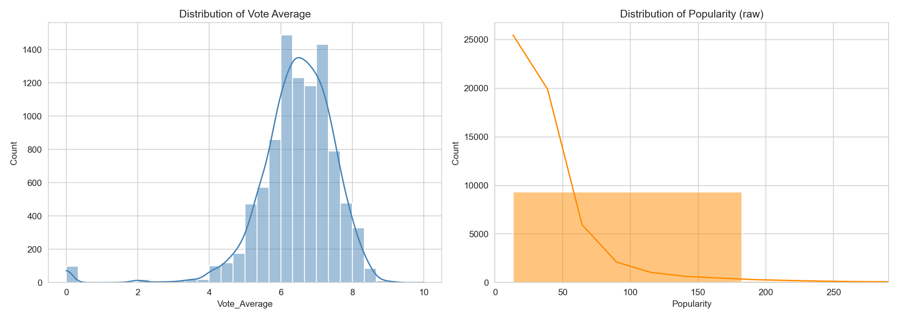

**English (`en`) overwhelms every other language by a huge margin — roughly 7x the next closest language, Japanese. The dataset is effectively an English-language catalog with a long tail of other languages.**
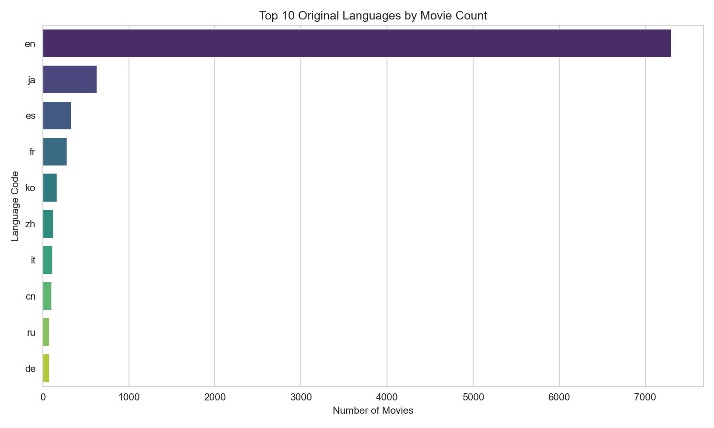

**Drama and Comedy are by far the most produced genres, followed by combinations like Drama+Romance and Horror. Single-genre Drama alone accounts for the largest single bar.**
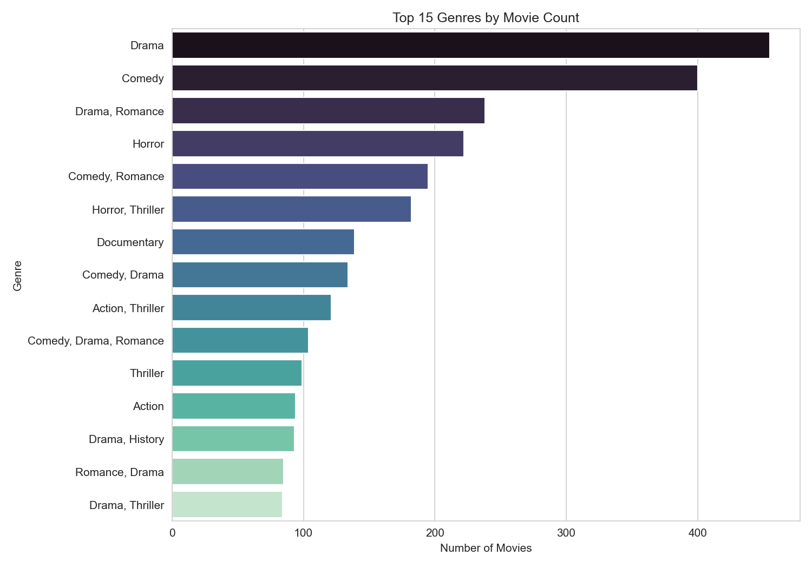

**Genre combinations involving Animation dominate the highest-average-rating list — Family/Comedy/Mystery/Animation and Animation/Fantasy/Action/Adventure mixes outscore everything else, suggesting animated films are rated more generously (or have more devoted audiences) than average.**
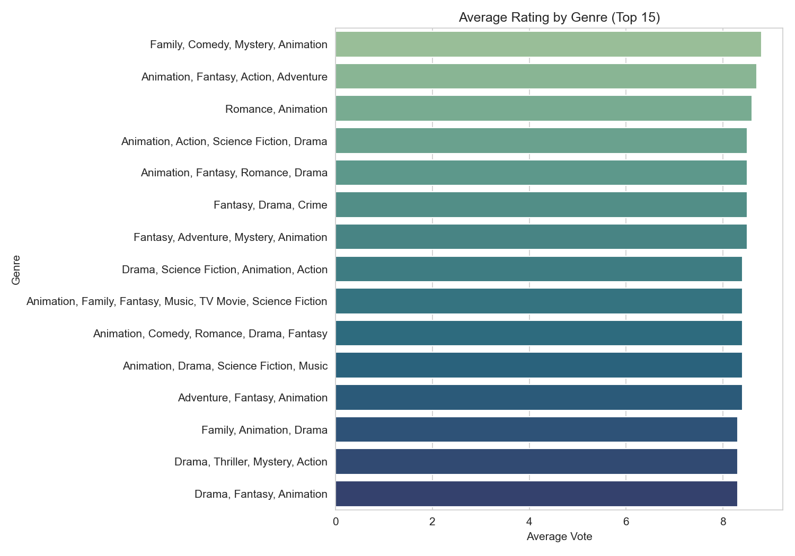

**Movie output grew roughly exponentially from the 1980s onward, peaking around 2017–2019. The sharp spike and subsequent crash after 2021 is a data artifact — recent years are underrepresented because newer releases haven't accumulated votes/metadata yet, not because movie output collapsed.**
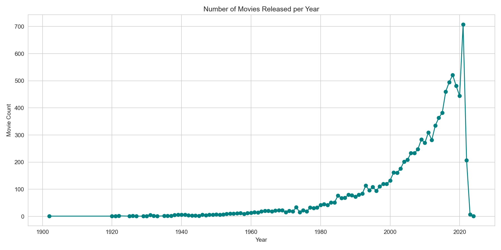

**Average rating per year stayed remarkably stable — mostly 6.3–8 — across a full century of film, only breaking down at the very end of the timeline. That final cliff to near-zero is the same data-completeness artifact: very few, poorly-voted records for 2023–2024.**
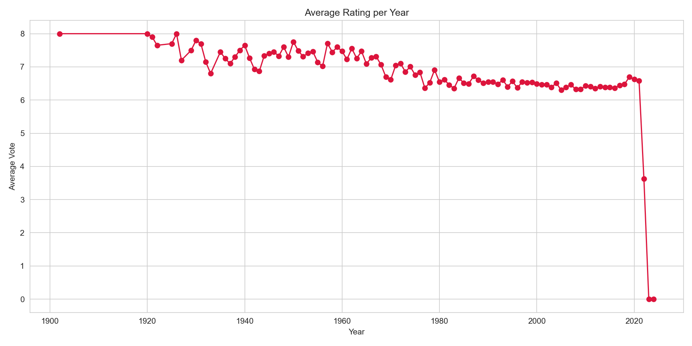

**Vote count and rating show a mild positive relationship — movies with more votes skew slightly higher-rated (r ≈ 0.25), likely because poorly-received movies get less audience engagement in the first place. Popularity, on the other hand, is almost uncorrelated with rating (r ≈ 0.05) — a movie can be extremely popular without being well-reviewed.**
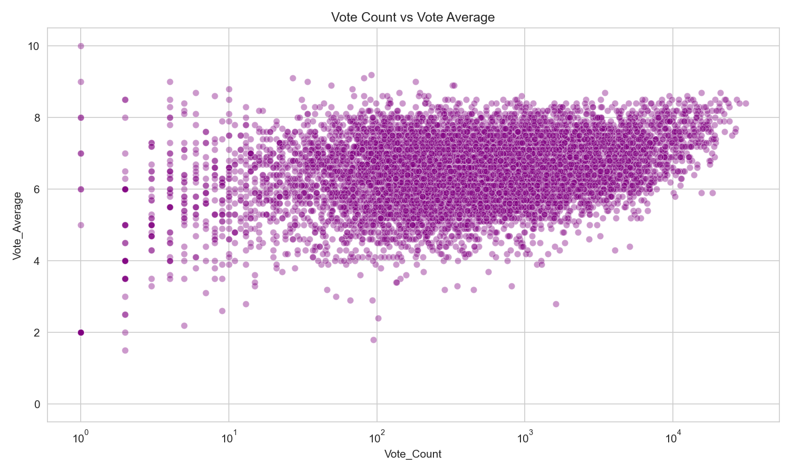
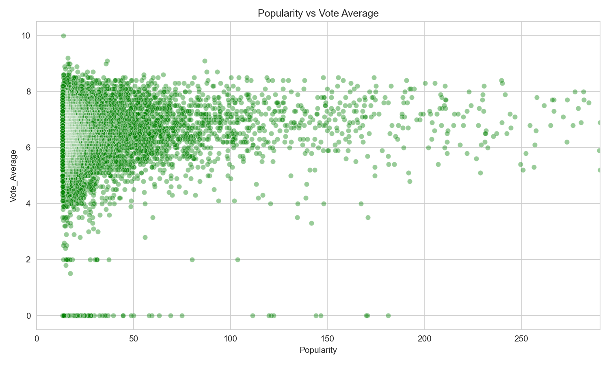
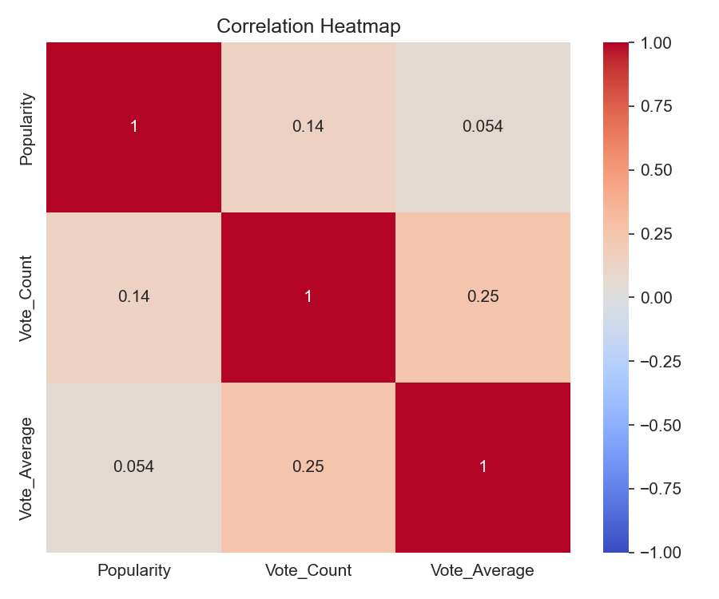

**The most *popular* and the most *highly-rated* movies are almost entirely different lists. Popularity is dominated by recent blockbusters (Spider-Man: No Way Home, The Batman), while top ratings go to acclaimed classics (The Godfather, The Shawshank Redemption, Schindler's List) — popularity tracks buzz, rating tracks quality.**
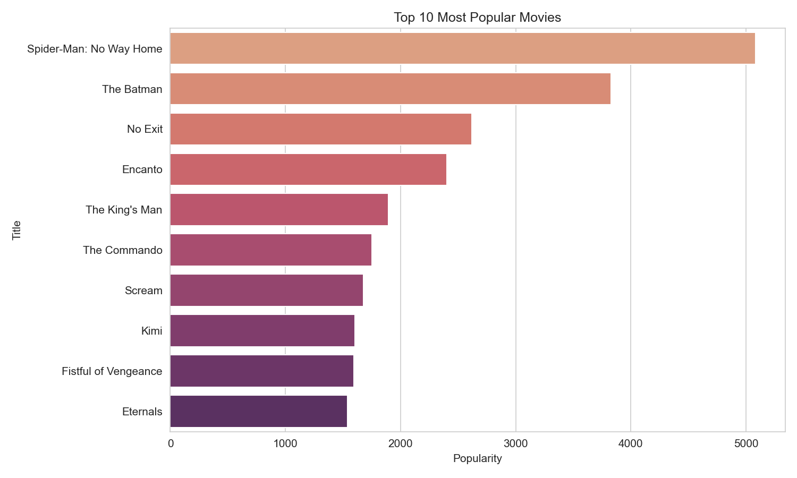
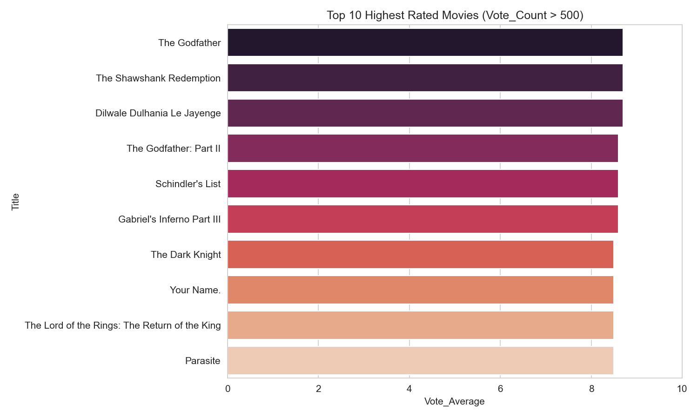

---

## Author
Mohamed Safeek
Linkedin  -  www.linkedin.com/in/safeek8670
Gthub     -  https://github.com/safeekjr

